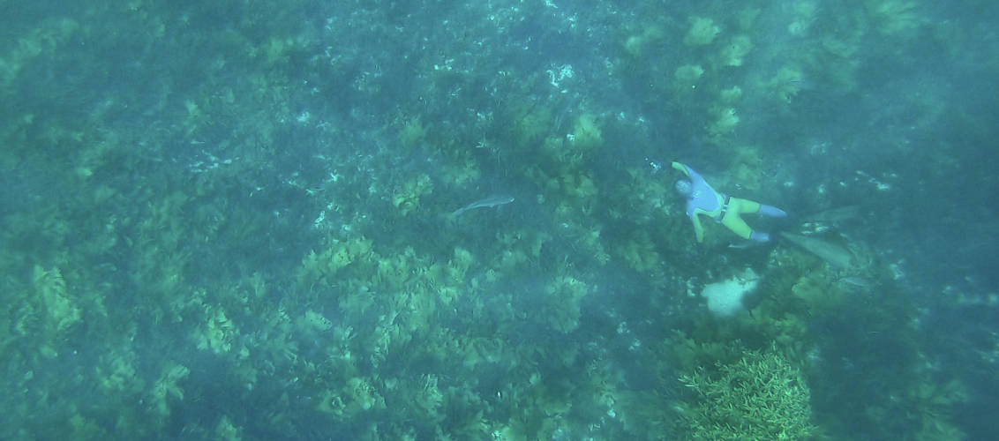

I do research to drive more sustainable use of the coastal marine environment. I'm especially interested in understanding the positive and negative effects of aquaculture (fish, shellfish and seaweed farming) on wildlife populations, how to improve animal welfare in fish farming, and how to maintain productive and diverse temperate reef ecosystems in areas impacted by human activities.  
  
  
  
## Main research topics
    
**Interactions between aquaculture and the environment**  
Aquaculture modifies coastal marine environments by providing structure and altering nutrient dynamics. This has wide-ranging effects on the benthic environment, water quality and wildlife populations. A better understanding of these effects can help achieve more positive outcomes, mitigate negative impacts, and maximise provision of ecosystem services for coastal communities.  
  
**Managing sea lice in salmon farming**  
Intensive salmon farming has brought great economic benefits, but also problems. Salmon farms amplify pathogens and parasites, especially sea lice, causing welfare issues and production losses for farmed salmon and threatening wild salmonid populations around heavily infested farms. New methods are needed to prevent, monitor and treat infestations.  
  
**Ecology of temperate reefs and associated animal communities**  
Seaweed and kelp habitats are diverse and productive, but have come under threat from multiple stressors including eutrophication, sedimentation and overgrazing. I'm interested in the conservation of seaweed habitats in degraded coastal areas, including the role of invasive macroalgae and management of overabundant sea urchins.  
