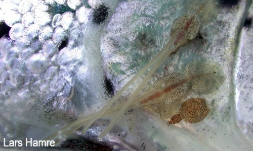

I do research that drives more sustainable and ethical aquaculture, as well as a better understanding of how aquaculture activities 
interact with the coastal marine environment. The dream is the development of aquaculture industries that have negligible or positive effects on the local environment.  
  
I use a range of approaches, including field and lab experiments, systematic reviews and meta-analyses, and more recently, analysis of large public databases. 
  

&nbsp;

  
### Current projects
  

&nbsp;

  
1. **Interactions between aquaculture and wildlife**  
Aquaculture modifies coastal marine environments by providing structural complexity and export of nutrients to the environment. A better understanding of effects on wildlife can be used to minimise negative impacts and maximise beneficial effects. I'm currently working with The Nature Conservancy to better understand the role of seaweed and shellfish farms as habitat for marine animals.  
  
**Recent work:**  Barrett LT, Swearer SE, Dempster T (2019) Impacts of marine and freshwater aquaculture on wildlife: a global meta-analysis. *Reviews in Aquaculture*. [URL](https://doi.org/10.1111/RAQ.12277) [pdf](https://github.com/neoodax/research/blob/master/Barrett%20et%20al%202018%20RAQ%20wildlife.pdf)
   

  

&nbsp;

2. **Sea lice in Atlantic salmon aquaculture**  
Salmon farms amplify louse densities, causing welfare issues and production losses for farmed salmon and threatening wild salmonid populations. New methods are needed to prevent, monitor and treat infestations. Most of this work is done in collaboration with researchers at the Norwegian Institute of Marine Research, with funding from FHF and MSD Animal Health Norway.  
  
**Recent work:**  Barrett LT, Overton K, Stien LH, Oppedal F, Dempster T (In Press) Effect of cleaner fish on sea lice in Norwegian salmon aquaculture: a national scale data analysis. *International Journal for Parasitology*.  
  

  

&nbsp;

  
3. **Ecology of seaweed and temperate reef habitats**  
Seaweed reef habitats are under threat from multiple stressors, including eutrophication, sedimentation and overgrazing. Kelp forests in particular have undergone massive declines. I'm interested in how to maintain seaweed habitats in degraded coastal areas, as well as documenting their important role as habitat for marine fish and invertebrates.  

**Recent work:**  Barrett LT, Dempster T, Swearer SE (2019) A nonnative habitat-former mitigates native habitat loss for endemic reef fishes. *Ecological Applications*. [URL](https://doi.org/10.1002/eap.1956) [pdf](https://github.com/neoodax/research/blob/master/Barrett%20et%20al%202019%20Ecol%20Apps%20wakame.pdf)  
  

